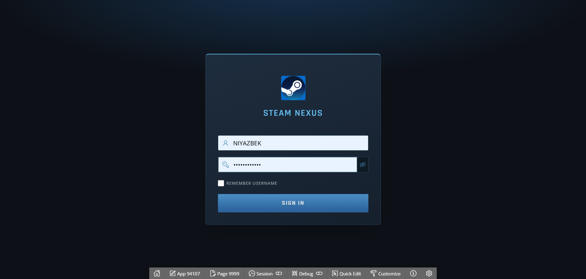

# Steam Nexus Oracle APEX

## Status

| Area | Status |
|---|---|
| Object Browser export | Collected |
| Compile-ready database layer | Prepared |
| App Builder full export | Collected |
| App Builder review | Prepared |
| Oracle/APEX runtime validation | Not run locally |

Local validation is limited to static file checks. Final validation must be done in Oracle APEX.

## Counts

| Object | Count |
|---|---:|
| Application tables | 19 |
| APEX helper tables | 1 |
| Indexes | 8 |
| Sequences | 9 |
| Packages | 5 |
| Standalone functions | 18 |
| Standalone procedures | 19 |
| Final triggers | 8 |
| APEX pages | 18 |
| APEX page processes | 18 |
| Dynamic actions | 2 |
| Validations | 2 |

## Structure

| Path | Purpose |
|---|---|
| `database/install` | Entry scripts and invalid-object check |
| `database/objects` | Compile-ready Oracle objects |
| `database/raw` | Raw Object Browser exports |
| `database/optional` | Optional draft SQL, not part of main install |
| `apex_export` | Full App Builder export |
| `docs` | Review notes, inventory, install order |
| `docs/screenshots` | Screenshots for README/report |
| `data` | Seed data and generators |
| `diagrams` | DBML/PDF/SVG diagrams |

## Install

Existing APEX schema:

```sql
@database/install/00_patch_existing_apex.sql
```

Clean schema:

```sql
@database/install/00_install_fresh.sql
```

After database scripts:

1. Import `apex_export/f94107_full_export.sql`.
2. Apply fixes from `docs/app_builder_review.md`.
3. Run `database/install/99_check_invalid_objects.sql`.

## Required App Builder Fixes

1. Move `LOAD_G_USER_ID` from page 4 to Page 0 or global before-header process.
2. Page 70: change `USER_ID = :APP_USER` to `USER_ID = :G_USER_ID`.
3. Add `Administration` authorization to pages 13, 14, 15.
4. Page 60: add authorization or filter by `USER_ID = :G_USER_ID`.
5. Page 80: add `USER_ONLY` and owned-game validation.
6. Hide `PASSWORD_HASH` on pages 8 and 70.
7. Remove page 4 from navigation.

## UI Preview

Login page:



Only the login screen is included. Other pages require a working APEX session and test data after import.

| Screen | Evidence |
|---|---|
| Login | Included |
| Home/dashboard | Not available |
| Catalog | Not available |
| Game detail | Not available |
| Cart | Not available |
| My Library | Not available |
| Purchases/refund | Not available |
| Admin Dashboard | Not available |

## Main Files

| File | Purpose |
|---|---|
| `database/install/00_patch_existing_apex.sql` | Patch existing APEX schema |
| `database/install/00_install_fresh.sql` | Clean database install |
| `database/install/99_check_invalid_objects.sql` | Invalid object diagnostics |
| `apex_export/f94107_full_export.sql` | Full APEX application export |
| `docs/app_builder_review.md` | App Builder findings and fixes |
| `docs/object_inventory.md` | Object counts and source map |
| `docs/install_order.md` | Installation order |
